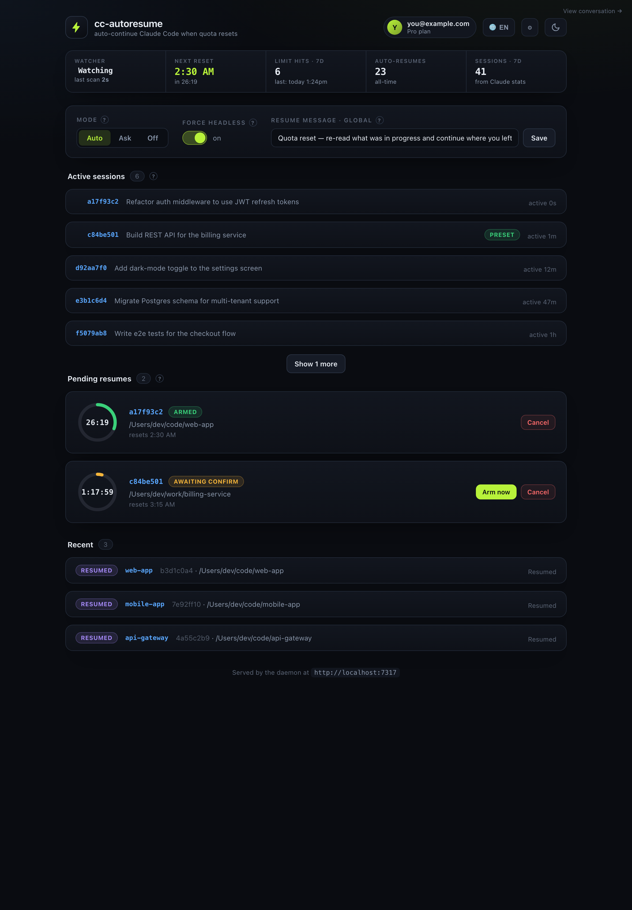
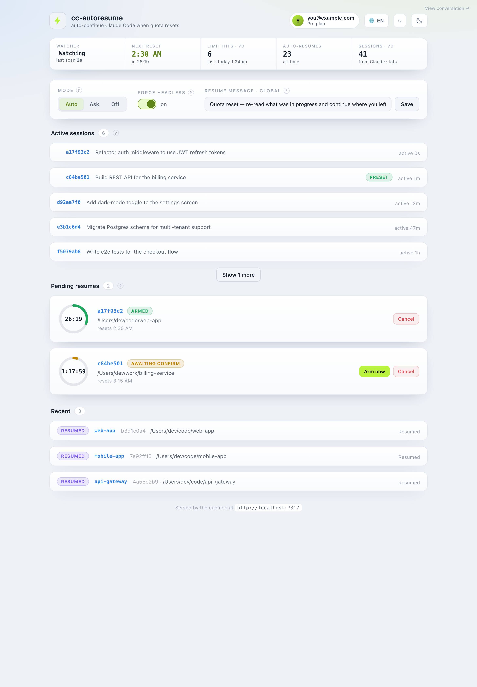
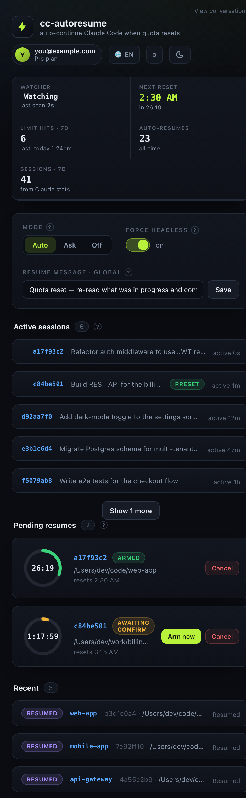

<div align="center">
  
  <h1>cc-autoresume</h1>
  <p><b>Your Claude Code session hit its limit at 2 a.m. — and resumed itself by morning.</b></p>
  <p>Auto-resume Claude Code when your usage limit resets, with a live web dashboard you can drive from your phone.</p>

  <p>
    <a href="https://github.com/cuongdev/cc-autoresume/actions/workflows/ci.yml"></a>
    
    
    
    
  </p>

  
</div>

---

## The problem

You give Claude Code a long task and walk away. Twenty minutes in, it stops:

> **You've hit your limit · resets 2:30am**

The quota comes back at 2:30 — but you're asleep. The work just sits there until you come back, notice it stalled, and press continue. Hours wasted for nothing.

## The fix

**cc-autoresume** watches your Claude Code transcripts on disk, catches that limit message, parses the reset time, and the moment quota returns it resumes the session for you:

```
claude -p "<your continue message>" --resume <session-id>
```

Set it once and walk away. It's a **single static Rust binary** — no Python, no venv, no runtime to install — plus a live web dashboard so you can see and steer everything (even from your phone on the same Wi-Fi).

## Highlights

- 🌙 **Resumes while you sleep** — detects the limit, waits for reset, resumes headless, retries with backoff if quota isn't fully back.
- 🎛️ **Three modes** — `auto` (just do it), `ask` (wait for your OK), `off` (notify only) — set globally, per-project, or per-session.
- 📊 **Live dashboard** — countdown rings, watcher status, usage stats, mode & message controls, all updating in real time over SSE.
- 🔭 **Proactive setup** — list sessions active in the last 24h and pre-write their resume message + mode *before* they ever hit a limit.
- 👀 **Live conversation tail** — watch a headless resume actually happen, streamed into the browser.
- ✍️ **Per-session messages** — every session can carry its own task-specific "here's where you were" instruction.
- 📱 **Phone-ready** — scan a QR in Settings to open the tokenized dashboard on your phone.
- ✨ **Polished** — light/dark theme, English/Vietnamese, inline help tooltips, friendly session titles.

## Screenshots

| Light theme | Phone |
|:--:|:--:|
|  |  |

*Pending resumes count down on animated rings; active sessions show a friendly title (their first prompt) instead of a raw UUID.*

## Install (macOS)

```bash
git clone git@github.com:cuongdev/cc-autoresume.git
cd cc-autoresume
./install.sh        # builds the release binary, installs to ~/.local/bin, loads the LaunchAgent
```

`install.sh` builds, drops `cc-autoresume` into `~/.local/bin`, and registers a LaunchAgent so the watcher + dashboard run at login. Then open the dashboard:

```bash
cc-autoresume dashboard      # prints http://<lan-ip>:7317/?token=...
```

> 💤 Want it to wake a *sleeping* Mac exactly at reset time? `install.sh` prints an optional one-line `sudoers` entry for `pmset`. Skip it and the resume simply fires on the next wake.

## CLI

Everything in the dashboard is also a command — use whichever you like.

| Command | What it does |
|---|---|
| `cc-autoresume dashboard` | print the tokenized dashboard URL |
| `cc-autoresume mode auto\|ask\|off` | set the global mode |
| `cc-autoresume msg "<text>"` | set the global resume message |
| `cc-autoresume list` / `status` | list pending resumes |
| `cc-autoresume cancel [prefix]` | cancel one (by id prefix) or all |
| `cc-autoresume arm <prefix>` | confirm an `ask`-mode resume |
| `cc-autoresume fire <id>` | resume a session right now |
| `cc-autoresume token [--rotate]` | print / rotate the dashboard token |
| `cc-autoresume watch` | run the daemon + dashboard (used by the LaunchAgent) |

## How it works

```
~/.claude/projects/**/*.jsonl        (Claude Code transcripts)
        │  tail (watcher, every 20s)
        ▼
   detect "limit · resets <time>"  →  parse reset time  →  arm a pending resume
        │                                  (per-session preset → per-project → global)
        ▼  at reset  (best-effort pmset wake)
   liveness check (lsof)  →  claude -p "<msg>" --resume <id>  →  backoff if still limited
```

The resume runs through a login shell so the revived session inherits your real `PATH` (Node-based hooks and friends keep working). State lives in `~/.claude/auto-resume/`: `config.json`, `pending/<id>.json`, `stats.json`, `sessions.json`.

## Configuration

`~/.claude/auto-resume/config.json` (camelCase):

| Key | Meaning |
|---|---|
| `mode` | `auto` / `ask` / `off` |
| `defaultMessage` | global resume message |
| `forceHeadless` | resume in the background even if the old window is still open |
| `backoff` | `{ everySec, maxAttempts }` retry policy when quota isn't fully back |
| `perProject` | per-directory mode/message overrides |
| `port` | dashboard port (default `7317`) |
| `token` | dashboard access token (auto-generated) |

Per-session presets live in `sessions.json`.

## Security

The dashboard binds `0.0.0.0` (so your phone on the same Wi-Fi can reach it) and is guarded by a random bearer token over plain HTTP. Anyone with the token on your network can control resumes — which run `claude` — so use it on a **trusted LAN** and rotate the token from **⚙ Settings** if it leaks. No TLS (out of scope). cc-autoresume never stores or transmits your Claude credentials; it only shells out to the `claude` CLI you already use.

## Limitations

- **macOS-first** — uses LaunchAgent + `pmset` + `osascript` notifications. Linux would need systemd + `rtcwake` + `notify-send`.
- Waking a sleeping Mac at the exact reset time needs the optional `sudoers` entry; otherwise the resume fires on the next wake.
- The official Claude usage % is server-side, so the dashboard shows locally-derived stats (limit hits, auto-resumes, active sessions), not the exact remaining percentage.

## Development

```bash
cargo test                 # unit + integration tests
cargo clippy --all-targets # lints
cargo build --release      # static binary at target/release/cc-autoresume
```

The dashboard is a single `src/web/index.html` (vanilla JS, no build step) embedded into the binary at compile time via `include_str!`.

## License

[MIT](LICENSE)
